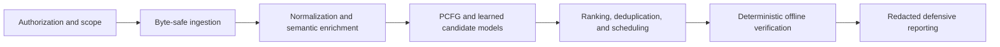

# 3lackcat Research

> **Status: design and research phase.** This repository is under active development. The architecture, interfaces, experiments, and roadmap described here are provisional; there is no stable release or production-ready implementation.

3lackcat Research is an applied cryptographic-security and algorithmic research project for **authorized, offline password recovery, defensive password auditing, and controlled security research**. It investigates how deterministic password and key-derivation-function verification can be surrounded by better data handling, probabilistic modeling, candidate ordering, resource allocation, reproducible evaluation, and explainable defensive reporting.

The project does not currently claim new ciphers, hash functions, protocols, or other cryptographic primitives. Its cryptographic focus is the correct and governed use of password/KDF verification, exact-byte handling, integrity, privacy, and reproducibility around sensitive security artifacts.

## Executive summary

Existing recovery and audit workflows can waste finite compute budgets on duplicated, malformed, poorly ordered, or weakly documented candidate streams. 3lackcat explores a probability-ranked orchestration layer around an external deterministic verifier - for example, hashcat - so candidate-generation research can evolve without weakening the verification boundary.

The governing principle is:

> Models propose and rank candidates. Scheduling allocates a finite evaluation budget. A deterministic verifier confirms or rejects candidates. Defensive reporting explains the result, provenance, and security implications.

The intended research workflow is local, offline, scoped, auditable, and privacy-aware. The goal is not undisciplined brute force; it is to measure whether byte-correct, deduplicated, semantically traceable, and better-ordered candidates improve defensive recovery value under controlled conditions.

## System at a glance

| Research layer | Top-level responsibility |
|---|---|
| Governance and safety | Authorization, target and data scope, audit trails, retention, and redaction requirements |
| Data foundation | Byte-preserving ingestion, provenance, controlled normalization, and separation of metadata from sensitive payloads |
| Research models | Semantic enrichment, probabilistic context-free grammars, learned generators, ordered decoding, and scope-approved contextual conditioning |
| Algorithmic orchestration | Candidate ranking, uniqueness and coverage accounting, finite-budget scheduling, observability, and reproducible evaluation |
| Deterministic verification | A narrow, tool-agnostic boundary around an external offline verifier; model scores never establish a recovery result |
| Defensive outputs | Redacted findings, semantic weakness analysis, reproducibility manifests, and remediation-oriented reporting |

## Initial research program: Functions 1-7

The first research track covers the front half of the proposed system:

1. **Authorization and Scope Gate** - a fail-closed, auditable boundary for operators, targets, approved datasets, permitted outputs, plaintext handling, expiration, and retention.
2. **Ingestion Broker** - scope-aware, streaming, byte-preserving import of approved corpora and artifacts into structured, provenance-rich records.
3. **Input Normalization Intelligence** - non-destructive, scored variant families for encoding, Unicode, layout, and related transformations while preserving original bytes and limiting expansion.
4. **Semantic Enrichment Engine** - ambiguity-aware parsing of candidates into explainable, versioned semantic structures using only approved contextual sources.
5. **Semantic PCFG Builder** - interpretable probability models over semantic patterns, components, and transformations, with calibration and derivation provenance.
6. **Learned Candidate Generator** - governed byte-aware sequence modeling with data lineage, careful evaluation splits, model documentation, calibration, and memorization controls.
7. **Ordered Neural Decoding** - deterministic or explicitly approximate probability-ranked search, with policy filtering, deduplication, batching, checkpointing, and replay.

Later system research extends this foundation with mixture ranking, target-profile modeling, conservative adaptive scheduling, coverage ledgers, environment profiling, verifier adapters, and defensive feedback.

## Research questions

- Can semantic PCFGs (Probabilistic Context-Free Grammars) and learned sequence models improve fixed-budget candidate ordering over strong conventional baselines?
- Which decoding methods best balance probability order, diversity, determinism, memory use, and throughput?
- How can normalization increase useful coverage without corrupting original bytes or causing uncontrolled candidate expansion?
- How should multiple candidate sources be calibrated, deduplicated, and scheduled under a finite verification budget?
- Which provenance and semantic representations make results explainable and reproducible without exposing sensitive plaintext?
- What authorization, retention, redaction, and dataset-governance controls are required before higher-capability modeling is evaluated?

## Evaluation posture

All efficacy claims are considered unproven until measured on approved, held-out data under fixed budgets. Planned comparisons include static wordlists and rules, classic and semantic PCFGs, random neural sampling, ordered decoding, and hybrid PCFG-neural methods.

Representative measures include coverage at a fixed candidate budget, verified recoveries per candidate or compute-hour, duplicate rate, calibration, deterministic replay, exact byte round-tripping, parser quality, provenance completeness, and policy violations. Evaluation design must control source leakage, group related normalization families, separate train and test material, and document datasets and model versions.

## Development roadmap

1. **Scope and governance** - freeze the research boundary, authorization model, retention policy, sensitive-data rules, verifier interface, and evaluation-corpus policy.
2. **Auditable foundations** - establish manifests, event records, sensitive-artifact controls, ingestion, deduplication, and deterministic verification joins.
3. **Core algorithmic path** - develop normalization, semantic enrichment, semantic PCFGs, small learned generators, ordered decoding, ranking, and conservative scheduling.
4. **Safety and validation** - add redaction review, metrics, replay and integrity tests, baseline comparisons, schema versioning, and operational stop conditions.
5. **Research hardening** - improve operator surfaces, documentation, model and dataset cards, packaging, calibration, and controlled reproducibility.
6. **Post-MVP exploration** - consider larger training pipelines, advanced scheduling, GPU optimization, distributed workers, and cross-run learning only after separate security, governance, cost, and efficacy reviews.

## Operating boundaries

This project is intended only for lawful work with explicit authorization, such as recovery for assets owned or administered by the operator, written-scope enterprise password audits, properly authorized forensics, and research using approved datasets.

It is **not** designed for online login automation, credential stuffing, phishing, rate-limit evasion, access-control bypass, or unauthorized account access. Ambiguous scope must fail closed. Private repository access does not itself grant authorization to use this research or any future software against a target.

Sensitive inputs and outputs require data minimization, provenance, access control, redacted logs, and explicit retention or destruction rules. Plaintext may exist only where operationally necessary and approved, and should remain access-controlled and ephemeral wherever possible.

## Current non-claims

At this stage, 3lackcat Research is not production-ready, independently audited, benchmark-validated, or claimed to be state of the art. Performance gains described in design work are hypotheses to test, not achieved results. Advanced model training, high-performance decoding, distributed orchestration, and operational integrations remain later research areas.

## Design basis

This overview is synthesized from the internal *3lackcat System Design Document* and *3lackcat Design Outline: Functions 1-7*. It will evolve as research questions are tested and approval-gated architecture decisions are resolved.

Reference: SE#PCFG: Semantically Enhanced PCFG for Password Analysis and Cracking  
https://arxiv.org/abs/2306.06824 
